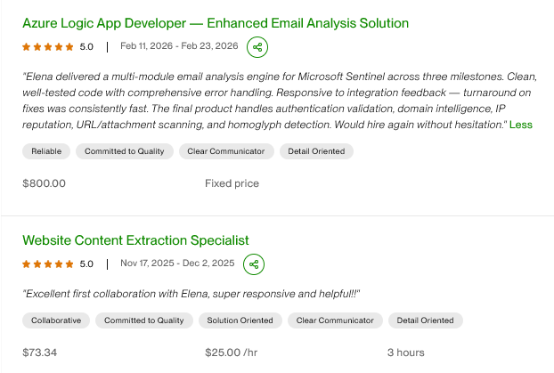

# Elena Gusarevich | Python Backend Developer / Python Automation Engineer

**Specialization:** Anti-bot systems, scraping pipelines, and production-grade automation systems  
**Impact:** 9,000+ active users across bot infrastructure
🟢 **Available for remote opportunities**

---

## 💼 What I Do

Python Backend Developer / Python Automation Engineer focused on backend automation, security workflows, API integrations, scraping infrastructure, and production Python systems.

Experienced in building modular backend services, async processing pipelines, threat intelligence enrichment workflows, anti-bot automation, and resilient analytics systems.

Recently delivered Microsoft Sentinel automation projects involving MSTICPy, KQL orchestration, Azure ML notebooks, cross-domain correlation, Isolation Forest anomaly detection, SHAP explainability, and incident automation workflows.

Strong in API debugging, HTTP session analysis, clean architecture, maintainable business logic, and production-ready automation solutions.

---

## 🛠 Technical Skills

Experienced in building backend automation systems, analytics pipelines, data-processing workflows, and production-ready orchestration for integration-heavy applications.

### Core
Python 3.10+, AsyncIO, OOP, Clean Architecture
### HTTP & APIs
requests, httpx, REST APIs, sessions, cookies, headers
### Automation
SeleniumBase (UC Mode), Playwright, browser automation, scraping infrastructure, HTTP session debugging
### Languages
Python, SQL, JavaScript
### Backend
FastAPI, REST APIs, async workers, service layer architecture, repository pattern, background jobs
### Security & Threat Intelligence
MSTICPy, WHOIS, DNSBL, GeoIP, URLhaus, MalwareBazaar
### Analytics
pandas, Plotly, SHAP, Isolation Forest, merge_asof
### Analytics & Automation
anomaly detection, structured analytics, data processing, risk scoring, decision workflows
### Cloud & Infrastructure
Docker, Linux, Systemd, Azure ML, MongoDB, PostgreSQL
### Testing
pytest, pytest-asyncio, pytest-cov, integration testing

---

## 🚀 Featured Projects

### 🛡 [Email Analysis Engine (Microsoft Sentinel)](https://hel-3d.github.io/hel-3d/projects/projects_email_analysis_engine_for_microsoft_sentinel.html)
**Problem:** Need automated phishing analysis in security incidents  
**Solution:** Modular Python engine with authentication checks, threat intelligence, and scoring  
**Impact:** Used in production security workflow for automated incident analysis  
**Tech:** Python, APIs, WHOIS, DNSBL, GeoIP, URLhaus, MalwareBazaar

### [🔐 SMS Verification & Anti-Bot Bypass System](https://github.com/hel-3d/automation-case-sms)
**Problem:** Automated registration blocked by Cloudflare and Incapsula  
**Solution:** Custom Chrome Extension for proxy authentication + human behavior emulation  
**Impact:** 99% success rate on React SPAs with dynamic protection  
**Tech:** SeleniumBase (UC Mode), Manifest V3, RuCaptcha API, Proxy rotation

---

### [🤖 High-Load Telegram Bot Ecosystem](https://t.me/works_gamedev)
**Problem:** Manual job posting distribution across 20+ Telegram channels  
**Solution:** Distributed automation system with Telegram as interface layer 
**Impact:** 9,000+ active users | 80%+ filtering accuracy | Zero downtime  
**Tech:** Python, Aiogram 3, Telethon, MongoDB, Docker, systemd

---

### [🚗 AI-Powered Vehicle Data Pipeline](https://github.com/hel-3d/carlocate-city-parser)
**Problem:** Extracting vehicle auction data from protected websites and PDFs  
**Solution:** Multi-stage ETL with AI extraction, VIN validation, and mobile browser emulation  
**Impact:** Automated processing of 1,000+ records/day | Bypassed CAPTCHA protection  
**Tech:** Python, Gemini API, Playwright, Appium, NHTSA VPIC API, Google Sheets

---

### [💚 Ritma — SaaS-Style Notification Backend](https://hel-3d.github.io/hel-3d/projects/projects_ritma_notification_engine_saas.html)
**Problem:** Existing cycle tracking apps often compromise privacy, lack flexible notification logic, and are difficult to extend into scalable multi-platform systems.
**Solution:** Rebuilt an MVP into a modular SaaS-style backend platform with repository pattern, service layer, isolated adapters, background workers, and timezone-safe event modeling.
**Impact:** Production deployment | 784 automated tests | 91% test coverage | Partner-aware notification system with customizable delivery logic and async processing architecture
**Tech:** Python, AsyncIO, MongoDB, pytest, Docker, repository pattern, background workers

---

### [📥 Multi-Platform Media Downloader Bot](https://t.me/Hel_inst_bot)
**Problem:** Users need unified tool for downloading from Instagram, TikTok, X, LinkedIn  
**Solution:** Modular handler architecture with smart fallback chain (yt-dlp → API → metadata)  
**Impact:** Active production bot with media group support and broadcast system  
**Tech:** Python, pyTelegramBotAPI, Instaloader, yt-dlp, Selenium

---

### [🧠 LangGraph Chatbot with Tool Calling](https://github.com/hel-3d/langgraph-timebot)
**Problem:** Need stateless AI assistant with function execution  
**Solution:** LangGraph state machine with OpenAI tool integration  
**Impact:** Foundation for AI-assisted automation tools  
**Tech:** Python, LangGraph, LangChain, OpenAI GPT-4o, Pydantic

---

## 📊 GitHub Activity

  

---

## 💡 What Makes Me Different

✅ **Production mindset:** Every project designed for fault tolerance, logging, and restart safety  
✅ **Anti-bot expertise:** Deep knowledge of browser automation, CAPTCHA solving, and proxy management  
✅ **Full-stack approach:** From Selenium scripts to Dockerized microservices with MongoDB  
✅ **Technical leadership:** 5+ years managing teams and documenting complex systems  
✅ **Business-oriented:** Focus on metrics, uptime, and scalable architecture

---

### ⭐⭐⭐⭐⭐ Client Feedback (Upwork)

  

## 📫 Let's Connect

---

💼 **LinkedIn:** [linkedin.com/in/helena-gusarevich](https://www.linkedin.com/in/helena-gusarevich/)  
📧 **Email:** Pdf.man.3d@gmail.com  
💬 **Telegram:** @Hel_inst  
🌐 **Portfolio:** [hel-3d.github.io/hel-3d](https://hel-3d.github.io/hel-3d/)  
🌍 **Location:** Yerevan, Armenia (UTC+4) | Open to relocation

---

  

  <i>Building production-grade automation systems that work reliably under real-world conditions</i>

